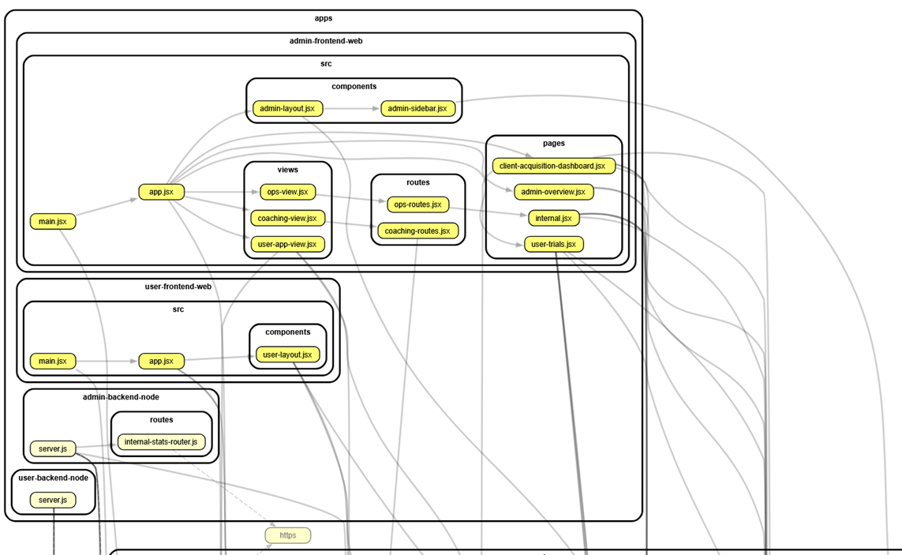
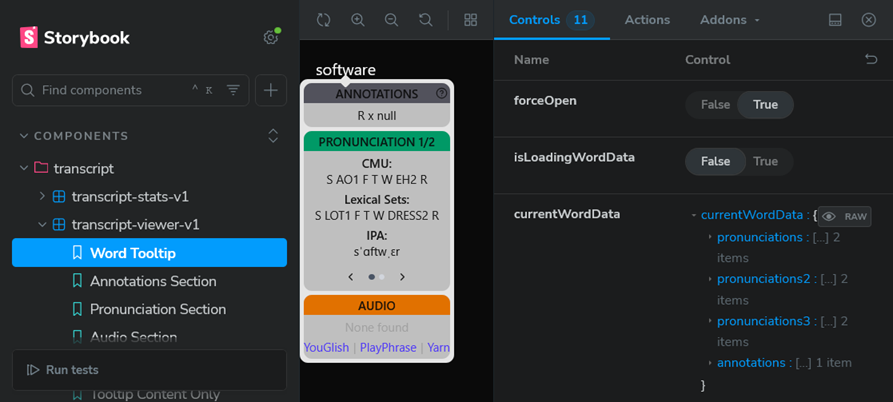

# 2025 Week 44 (Oct 27 - Nov 2)

Mon:
- In my Simple American Accent web app: temporarily made new "Accent Explorer" page admin-only while I improve it.
- Lots of updates to app ([17 commits today](https://github.com/SimpleAmericanAccent/saa-app-web/commits/main/?since=2025-10-27&until=2025-10-27))... and made the Accent Explorer (now Accent Targets) available to users again
  - Used Cursor AI a lot, tried to keep within fixed scope to limit potential blast radius. Didn't review 100% within that scope, there's stuff I am pushing out with a "looks about right" to get MVP for new functionality out
  - Ultimately: got a decent MVP version of Accent Explorer/Targets up and running. And cleaned up a few other things along the way.
- Also had another new user start using the Quiz for the first time today and they gave positive feedback ("I'm loving it")

Tue:
- Learning about best practices for planning/managing: features/project/product. 
  - Currently I have an [Issue](https://github.com/SimpleAmericanAccent/saa-app-web/issues/117) that collects a big brainstorm of ideas to improve the app. But it's too big and is overwhelming to look at / not very usable. 
  - ChatGPT mentioned this as a possible flow:
    - IDEAS.md → GitHub Issue → GitHub Project → Feature branch → PR → Done ✅
- Continuing to work on my business's app:
  - In Accent Explorer(/Targets), added ability to see top 20-100 most frequent words for each target phoneme. Also added button to send these to ChatGPT to generate phrases using these words.
  - Explored some ideas I haven't implemented yet:
    - Auth0 alternate auth options... passwordless, socials, etc. And how to link accounts when one person has multiple ways to log in, without security issues.
    - Linking from Quiz to Accent Explorer
    - Consolidating/refactoring lots across the app - currently have some things defined in multiple places, need to centralize into one source of truth.
  - Working on refactoring transcript-viewer-v1 to separate concerns better / have better composition... and/also make it easier to test... then want to set up testing for it (Jest & Storybook, at least)
    - Actually, maybe I'll make tests first, then refactor while making sure tests keep passing. Not sure yet, but that would be cool if I could get that to work.
    - Started pulling out some of the tooltip content into separate component(s). Still in same file at first, then may eventually move to separate file(s).
  
Wed:
- Continuing to work on my business's app:
  - To support refactoring and testing, trying to better understand what depends on what in my code, key concepts (API, signature, props, shape, seams, etc), key approaches to use, etc
    - Installed dependency-cruiser and graphviz. Learning to use those and Cursor's built-in abilities to navigate my code better and see connections between variables, functions, files, etc.
    - Made this <a href="images/dependency-graph.svg">crazy dependency graph image. Click this link to see the full image.</a> Here's just the first piece of it: 
    - Also looked into ts-morph a bit and played around with [TypeScript AST Viewer](https://ts-ast-viewer.com/)
    - Also updated my complicated tsconfig setup to get Intellisense working in Cursor again
  - Continuing to refactor transcript-viewer-v1 and updating Storybook story for it. Pulled out tooltip and its subcomponents  

Thu:
  - Less dev work today, more focused on generating business cashflow (gotta pay the bills)
  - Fixed a tooltip bug

Fri:
  - Continuing to work on my business's app:
    - Zoom call with client, they shared their screen and we used the app together. They loved it. Also noticed several bugs, opportunities for improvement, possible features to add, etc. Great feedback.
    - Noticed client was struggling to find what they needed in sidebar. Deploying a reorganized/simplified sidebar to try to improve this.

Sat:

Sun:

Summary:

Next:
